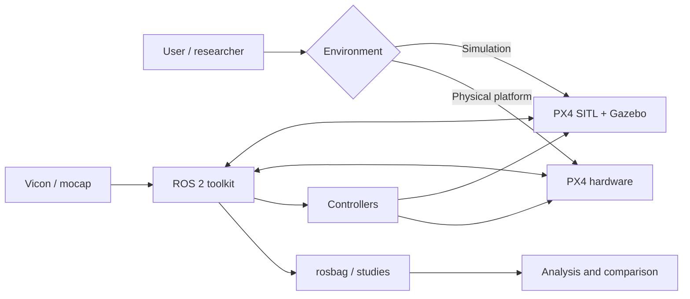

# PX4 Development Toolkit

A PX4 development toolkit for simulation, ROS 2 integration, Offboard control experiments, flight-data recording, and controller-pipeline analysis.

The repository keeps the runtime environments, controller examples, experiment workflows, and analysis tools together while pinning external PX4/ROS sources separately.

## Start here

Choose the path that matches what you want to do:

| Goal | Start here |
|---|---|
| Use a ready-made container | [Docker installation](docs/installation/docker.md) |
| Install directly on Ubuntu | [Native installation](docs/installation/native.md) |
| Run PX4 + Gazebo simulation | [SITL environment](docs/environments/sitl.md) |
| Run on a physical PX4 platform | [Hardware environment](docs/environments/hardware.md) |
| Run or understand controller examples | [Controllers](docs/controllers/overview.md) |
| Record or automate experiment runs | [Experiment workflows](docs/workflows/recording.md) |
| Analyze one run or compare controllers | [Analysis](docs/analysis/analysis.md) |
| Understand the repository and data flow | [Architecture reference](docs/reference/architecture.md) |

The complete documentation map is in [`docs/index.md`](docs/index.md).

## Quick start: Docker SITL

The lowest-setup path is the published SITL image:

```bash
docker pull ghcr.io/ancl/px4-dev-toolkit-sitl:latest

docker run --rm -it --network host \
  ghcr.io/ancl/px4-dev-toolkit-sitl:latest bash
```

Inside the container:

```bash
./tools/sitl start headless
```

Use another shell in the same container, or attach from your editor, for ROS 2/controller commands. See [Docker installation](docs/installation/docker.md) for persistent data, source builds, and the hardware image.

## What is included

- PX4 SITL with Gazebo
- ROS 2 Jazzy integration through uXRCE-DDS
- reusable SITL and physical-hardware launchers
- MAVProxy and QGroundControl integration
- native PX4 Position-mode and Offboard controller examples
- geometric SE(3) control with multiple PX4 handoff boundaries
- configurable trajectories and repeatable experiment sequences
- rosbag recording with explicit experiment metadata
- single-run analysis and multi-run SE(3) comparison
- Vicon-to-PX4 motion-capture bridge for the hardware stack
- pinned external sources and documented host/tool versions
- SITL and hardware Docker images

## System overview



Docker and native installation are two ways to obtain the same toolkit workflows; SITL and hardware are the two runtime environments. The detailed architecture and ownership boundaries are documented in [Architecture](docs/reference/architecture.md) and [Configuration](docs/reference/configuration.md).


## Repository layout

```text
px4-dev-toolkit/
├── analysis/        analysis implementation and experiment profiles
├── config/          runtime, vehicle, topic, sequence, source, and version config
├── docker/          SITL/hardware container build and Compose definitions
├── docs/            user and technical documentation
├── px4/             PX4 build helpers and fetched PX4 source location
├── ros2/            ROS 2 workspace, packages, build/test/runtime helpers
├── setup/           native installation and pinned-source setup
└── tools/           user-facing runtime, sequence, and analysis commands
```

External projects are fetched at pinned revisions instead of being vendored into this repository. Source and configuration ownership are described in [Architecture](docs/reference/architecture.md) and [Configuration](docs/reference/configuration.md).

## Documentation

Use the task-oriented documentation landing page: **[docs/index.md](docs/index.md)**.

The main entry points are [Docker](docs/installation/docker.md), [Native installation](docs/installation/native.md), [SITL](docs/environments/sitl.md), [Hardware](docs/environments/hardware.md), [Controllers](docs/controllers/overview.md), [Recording](docs/workflows/recording.md), [Sequences](docs/workflows/sequences.md), [Analysis](docs/analysis/analysis.md), [Comparison](docs/analysis/comparison.md), and [Extending the toolkit](docs/reference/extending.md).

## License

Toolkit code is released under the BSD 3-Clause License. Fetched third-party projects retain their upstream licenses.
