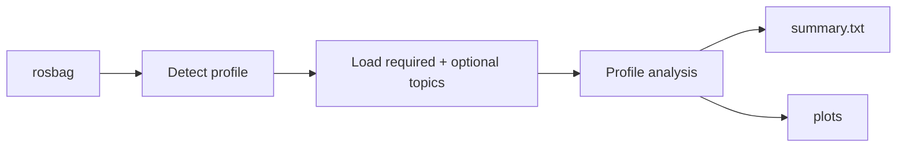

# Single-run analysis

[Documentation](../index.md) / Analysis / Single run

`tools/px4_analyze` analyzes one recorded experiment bag. The textual summary is the primary output; plots are additional output when plotting dependencies are available.

## Run

```bash
./tools/px4_analyze <bag-directory>
```

Example:

```bash
./tools/px4_analyze bags/se3/20261007_120000
```

## Profile detection

The analyzer supports these registered profiles:

```text
position_takeoff_hover
offboard_takeoff_handoff
offboard_position
se3
```

Profile selection is explicit when the bag contains `experiment.json`. Otherwise the analyzer falls back to the bag's parent-directory name.

Sequence-runner metadata is therefore preferred because it decouples profile detection from directory naming.

## Analysis flow



The analyzer loads only the topics required/optionally used by the selected profile rather than assuming every bag contains every PX4 signal.

## Output location

Results are written inside the bag:

```text
<bag>/analysis/
├── summary.txt
└── *.png
```

If plot generation cannot run, the completed summary is retained and the tool reports a warning rather than invalidating the textual analysis.

## SE(3) analysis

The SE(3) profile reconstructs a physical/control comparison view from the recorded trajectory reference, toolkit handoff, PX4 downstream pipeline, and optional controller diagnostics.

The common plot set includes position, velocity, acceleration, attitude, rate, thrust, torque, actuator, and mode/timeline views. Controller-specific diagnostic plots are added when the corresponding diagnostic topics are present.

The summary includes the experiment/lifecycle context and the metrics that are available for the recorded handoff rather than pretending every controller boundary exposes the same signals.

## Time alignment

Recorded PX4 topics are independently timestamped. Analysis aligns the relevant reference/actual series by time; comparison work additionally aligns separate runs to confirmed PX4 Offboard entry.

Do not compare samples by array index simply because two topics have similar rates.

## Interpreting the summary

Use the summary first to establish:

- whether the expected profile was selected,
- whether Offboard entry/exit happened as intended,
- whether required signals were present,
- which handoff/direct controller was used when metadata is available,
- tracking-error magnitude at the layers observable for that mode,
- actuator/control-allocation behavior where recorded.

Then use the plots to inspect transient shape, timing, saturation, and segment-specific behavior.

## Next

- [Comparison](comparison.md)
- [Recording](../workflows/recording.md)
- [Architecture](../reference/architecture.md)
