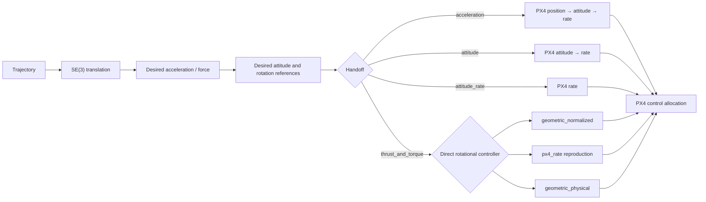

# Geometric SE(3) controller

[Documentation](../index.md) / Controllers / SE(3)

The SE(3) runtime is one controller family with a selectable handoff boundary. The translational controller is shared; the amount of rotational control retained by the toolkit depends on `handoff` and, for direct torque, `direct_controller`.

## Runtime flow

```text
valid PX4 state
→ prestream Offboard heartbeat + trajectory reference at t=0
→ request Offboard
→ wait for PX4 nav_state confirmation
→ anchor the trajectory at the current local position
→ run the controller to the configured handoff boundary
→ after trajectory completion, request Position mode
→ keep Offboard stream valid until PX4 confirms Position mode
```

PX4 `nav_state` is the authoritative ownership signal. If Offboard is lost before the requested return to Position mode, controller output stops; a later confirmed Offboard entry re-anchors and restarts the trajectory.

## Control ownership



| Selection | Toolkit owns | PX4 owns |
|---|---|---|
| `handoff:=acceleration` | translation controller | acceleration → attitude → rate → allocation |
| `handoff:=attitude` | translation + desired attitude | attitude → rate → allocation |
| `handoff:=attitude_rate` | translation + desired attitude/body-rate command | rate → allocation |
| `handoff:=thrust_and_torque direct_controller:=px4_rate` | SE(3) outer loop + reproduced pinned PX4 rate controller | allocation |
| `handoff:=thrust_and_torque direct_controller:=geometric_normalized` | complete normalized geometric controller | allocation |
| `handoff:=thrust_and_torque direct_controller:=geometric_physical` | physical geometric moment + physical-wrench adapter | allocation |

## Launch

Basic launch:

```bash
source ros2/runtime_env.sh
ros2 launch offboard_controllers se3.launch.py \
  vehicle:=gz_f450 \
  trajectory:=hover \
  handoff:=acceleration
```

Launch arguments:

| Argument | Default | Meaning |
|---|---|---|
| `vehicle` | `gz_f450` | vehicle configuration name |
| `trajectory` | `hover` | named trajectory |
| `handoff` | `acceleration` | PX4 handoff boundary |
| `direct_controller` | `geometric_normalized` | rotational controller used only with `thrust_and_torque` |
| `publish_diagnostics` | `false` | publish optional internal controller diagnostics |
| `record` | `false` | record the experiment |
| `recording_output` | empty | optional explicit rosbag path; sequence runner uses this |

Example direct controller:

```bash
ros2 launch offboard_controllers se3.launch.py \
  vehicle:=gz_f450 \
  trajectory:=full_excitation \
  handoff:=thrust_and_torque \
  direct_controller:=geometric_normalized \
  publish_diagnostics:=true \
  record:=true
```

## Frames, units, and timing

The controller uses PX4 local NED for translational quantities and FRD for body-frame quantities. Its internal attitude is the **FRD-body → NED** rotation, matching the PX4 Hamilton quaternion convention used by the published attitude setpoint.

| Signal | Frame / units | Source | Timing / ownership | Meaning / destination |
|---|---|---|---|---|
| state position | local NED, m | PX4 `VehicleLocalPosition` | latest PX4 state sample | measured translational state |
| state velocity | local NED, m/s | PX4 `VehicleLocalPosition` | latest PX4 state sample | measured translational state |
| state attitude | FRD body → NED, unit quaternion/rotation | PX4 `VehicleAttitude` | latest PX4 attitude sample | measured vehicle orientation |
| state angular velocity | FRD body, rad/s | PX4 `VehicleAngularVelocity` | PX4 gyro-sample timing | measured body rate; also drives reproduced `px4_rate` inner-loop timing |
| trajectory position | local NED, m | trajectory generator | ROS clock after confirmed Offboard entry | translational reference |
| trajectory velocity | local NED, m/s | trajectory generator | same trajectory clock | translational reference |
| trajectory acceleration | local NED, m/s² | trajectory generator | same trajectory clock | feed-forward acceleration reference |
| trajectory jerk / snap | local NED, m/s³ / m/s⁴ | trajectory generator | analytic trajectory derivatives | desired-attitude derivative construction |
| commanded acceleration | local NED, m/s² | SE(3) translation | outer-loop timer | kinematic command used by the acceleration handoff |
| force vector `A` | local NED, N | SE(3) translation | outer-loop timer | physical force-like control vector used to construct thrust direction/attitude |
| desired attitude | FRD body → NED | SE(3) attitude construction | outer-loop timer | PX4 attitude handoff or rotational reference |
| desired/body-rate command | current FRD body, rad/s | geometric attitude law | outer-loop timer | PX4 `VehicleRatesSetpoint` for the `attitude_rate` handoff; direct-controller rate reference otherwise |
| attitude/rate collective thrust | FRD body Z, PX4 normalized | projected physical force + vehicle hover-thrust calibration | outer-loop timer | published with PX4's negative body-Z multicopter sign |
| normalized torque | FRD body, PX4 normalized | `geometric_normalized` or reproduced `px4_rate` | controller-specific timing | `/fmu/in/vehicle_torque_setpoint` |
| physical moment | FRD body, N·m | `geometric_physical` | outer-loop timer | input to the physical-wrench/PX4 adapter before normalized torque publication |

The wall timer drives the Offboard heartbeat and SE(3) outer-loop cadence. ROS time timestamps messages and advances trajectory time. The reproduced `px4_rate` inner loop uses `VehicleAngularVelocity.timestamp_sample`, matching PX4's gyro-sample timing rather than assuming the outer-loop period.

The checked-in controller rate is `100 Hz`; lifecycle warmup is `1.5 s` and the Offboard request retry interval is `1.0 s`.

## Tuning ownership

Controller tuning lives in:

```text
ros2/src/offboard_controllers/config/se3/controller.yaml
```

This file owns:

- normalized translational gains (`kx_over_mass`, `kv_over_mass`)
- attitude/body-rate gain
- reproduced PX4 rate-controller gains and limits
- normalized geometric rotational gains
- physical geometric rotational gains
- controller/lifecycle timing

Do not place physical mass, inertia, rotor geometry, or actuator thrust curves in this controller file. Those belong to `config/vehicles/`.

## Vehicle support

Vehicle data is loaded from `config/vehicles/<vehicle>.yaml`. Different handoffs require different physical/configuration information.

| Vehicle | `acceleration` | `attitude` | `attitude_rate` | direct normalized / `px4_rate` | `geometric_physical` |
|---|---:|---:|---:|---:|---:|
| `gz_f450` | yes | yes | yes | yes | yes |
| `gz_x500` | yes | yes | yes | yes | no curated physical actuator-thrust mapping |
| `gz_px4vision` | yes | yes | yes | yes | no curated physical actuator-thrust mapping |
| `gz_fy690s` | yes | no | no | no | no; current vehicle file intentionally limits support to acceleration |

Why the requirements differ:

- `acceleration` needs vehicle mass for the toolkit translational controller, but PX4 performs the lower control stack.
- `attitude`, `attitude_rate`, and normalized direct-control paths require a vehicle-specific PX4 hover-thrust value to map physical collective force into PX4-normalized collective thrust.
- `geometric_physical` does not use `MPC_THR_HOVER`; it requires a curated physical actuator-thrust relationship, inertia, rotor geometry/directions, and the physical-wrench/PX4 allocator mapping.

The runtime rejects unsupported/missing configuration rather than silently inventing values.

## Diagnostics

With `publish_diagnostics:=true`, the controller publishes internal topics for commanded acceleration, force, desired attitude/angular velocity, body-rate setpoint, angular-acceleration feed-forward, and controller-specific feedback terms.

The SE(3) recording profile also records PX4 state, the Offboard handoff topics, downstream PX4 setpoints, control allocator status, actuator motors, and these diagnostics when present.

## Recording and comparison

Record one run:

```bash
ros2 launch offboard_controllers se3.launch.py \
  vehicle:=gz_f450 \
  trajectory:=full_excitation \
  handoff:=attitude_rate \
  publish_diagnostics:=true \
  record:=true
```

For a repeatable handoff study, use the checked-in sequence described in [Sequences](../workflows/sequences.md), then compare the resulting bags with [Comparison](../analysis/comparison.md).

## Next

- [Trajectories](trajectories.md)
- [Recording](../workflows/recording.md)
- [Sequences](../workflows/sequences.md)
- [SE(3) comparison](../analysis/comparison.md)
