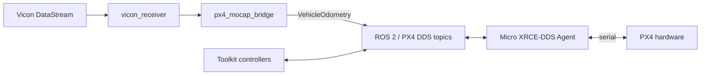

# Hardware environment

[Documentation](../index.md) / Environments / Hardware

This page covers the companion-computer software stack for a physical PX4 platform.

The repository retains `experiment` as the implementation name for this runtime. The corresponding interfaces remain `tools/experiment`, `config/runtime/experiment.env`, and the Docker `experiment` target/image name.

## Runtime architecture



`tools/experiment` starts the Vicon/mocap pipeline and, when enabled, the serial XRCE agent in one tmux session.

The PX4 flight controller itself is external hardware; this wrapper does not launch PX4 firmware.

## CLI

```bash
./tools/experiment start
./tools/experiment status
./tools/experiment stop
```

The default tmux session is `px4-experiment`.

## Runtime configuration

The canonical file is:

```text
config/runtime/experiment.env
```

It currently defines:

- XRCE transport (`serial` is required by `tools/experiment`)
- serial device and baud rate
- whether the XRCE agent is started by the wrapper
- Vicon server hostname and buffer size
- Vicon namespace and frame names
- map/Vicon rigid transform
- tracked `PoseStamped` topic
- timestamp behavior
- tmux session name

The checked-in device path is `/dev/ttyUSB0` at `921600` baud. In Docker, map the real host device to `/dev/ttyUSB0`; see [Docker installation](../installation/docker.md).

## Vicon and mocap path

`tools/experiment` launches `px4_mocap_bridge/mocap.launch.py`. That launch file:

1. includes the pinned `vicon_receiver` client,
2. applies the configured Vicon/map transform arguments,
3. starts `px4_mocap_bridge`, and
4. converts the selected `PoseStamped` stream into PX4 `VehicleOdometry` input.

The current tracked topic is configured by `MOCAP_TOPIC`; do not hard-code the checked-in example name into other parts of the project.

## Start checklist

Before `start`:

1. Verify the PX4 serial device exists and is accessible.
2. Verify `XRCE_AGENT_DEVICE` and `XRCE_AGENT_BAUD`.
3. Verify `VICON_HOSTNAME` is reachable from the companion computer/container.
4. Verify the tracked-object topic in `MOCAP_TOPIC` matches the Vicon object you intend to fly.
5. Verify the configured world/map transform for the current lab setup.
6. Source `ros2/runtime_env.sh` if you are running additional ROS commands manually.

Then:

```bash
./tools/experiment start
```

From another shell:

```bash
./tools/experiment status
```

## What `status` means

The launcher reports the tmux session and the relevant hardware-runtime processes. A running software stack is not the same as a flight-ready vehicle; hardware setup still needs to be checked on the actual platform.

## Pre-flight requirements

Before flight, verify the actual airframe, sensors, actuator mapping, estimator configuration, mocap alignment, RC/failsafe behavior, vehicle parameters, and selected controller mode.

`tools/experiment` prepares the companion-computer services; PX4 hardware configuration and flight readiness remain separate vehicle tasks.

## Next

- [Controller overview](../controllers/overview.md)
- [SE(3) vehicle requirements](../controllers/se3.md#vehicle-support)
- [Recording](../workflows/recording.md)
- [Configuration reference](../reference/configuration.md)
- [Troubleshooting](../reference/troubleshooting.md)
