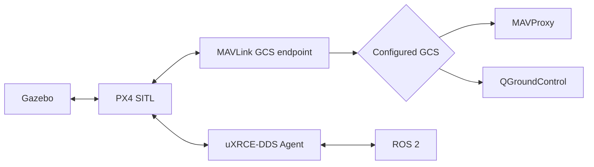

# SITL environment

[Documentation](../index.md) / Environments / SITL

This page covers operation of the toolkit's PX4 software-in-the-loop stack after either [Docker](../installation/docker.md) or [native](../installation/native.md) installation.

## What the launcher owns

`tools/sitl` owns one tmux session containing the configured simulation services.



The current runtime configuration is `config/runtime/sitl.env`.

## CLI

```bash
./tools/sitl start [headless]
./tools/sitl status
./tools/sitl stop
```

Running `start` when the tmux session already exists attaches to that session instead of launching duplicates.

### Start with Gazebo GUI

```bash
./tools/sitl start
```

### Start without Gazebo GUI

```bash
./tools/sitl start headless
```

`headless` changes Gazebo presentation only. PX4 SITL, the simulator server, ROS 2 connectivity, and the configured GCS still run.

### Inspect status

```bash
./tools/sitl status
```

Status reports both tmux state and the relevant processes so detached/stale components are visible.

### Stop

```bash
./tools/sitl stop
```

The stop path first shuts down tmux-owned processes and then cleans up Gazebo processes associated with this repository if Gazebo detached from the original process tree.

## Current default runtime

`config/runtime/sitl.env` currently selects:

```text
PX4_BUILD_TARGET=px4_sitl
PX4_SIM_MODEL=gz_f450
PX4_GZ_WORLD=default
XRCE_AGENT_TRANSPORT=udp4
XRCE_AGENT_PORT=8888
START_XRCE_AGENT=true
GCS=mavproxy
TMUX_SESSION=px4-sitl
```

The file also carries the estimator parameter overrides used by the default SITL setup. These settings configure external-vision/Gazebo odometry aiding and explicitly disable the other listed aiding sources.

## Ground-control frontend

The launcher accepts exactly:

```text
GCS=mavproxy
GCS=qgc
```

There is no `none` launcher mode in the current implementation.

MAVProxy is also the owner of the repository's software virtual-joystick stream used by the Position-mode staging helper. The `sitl` native install profile installs MAVProxy. QGroundControl is installed by the `all` profile or by `setup/install_qgroundcontrol.sh`.

## ROS 2 connectivity

When `START_XRCE_AGENT=true`, `tools/sitl` opens an `xrce-dds` tmux window and launches the agent through `px4_bringup/xrce.launch.py` using the configured UDP transport/port.

For manual ROS commands in another shell:

```bash
source ros2/runtime_env.sh
```

Useful checks include:

```bash
ros2 topic list | grep '^/fmu/'
./tools/topic_rates
```

The project-wide PX4 ROS topic names are centralized in `config/px4_topics.def`.

## Typical controller workflow

Start SITL first:

```bash
./tools/sitl start headless
```

Then, in another shell in the same environment:

```bash
source ros2/runtime_env.sh
ros2 launch offboard_controllers se3.launch.py \
  vehicle:=gz_f450 \
  trajectory:=hover \
  handoff:=acceleration
```

For the other controller examples and their ownership boundaries, see [Controllers](../controllers/overview.md).

## Configuration boundary

Use `config/runtime/sitl.env` for environment/process connectivity and simulator selection. Do not put controller gains or trajectory definitions there; those have separate canonical homes documented in [Configuration](../reference/configuration.md).

## Next

- [Controllers](../controllers/overview.md)
- [SE(3)](../controllers/se3.md)
- [Recording](../workflows/recording.md)
- [Troubleshooting](../reference/troubleshooting.md)
