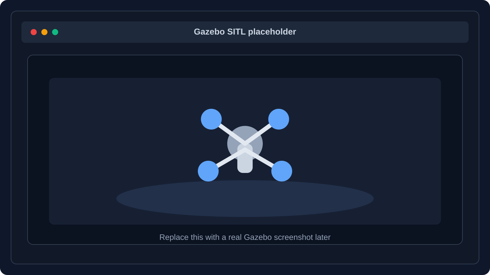
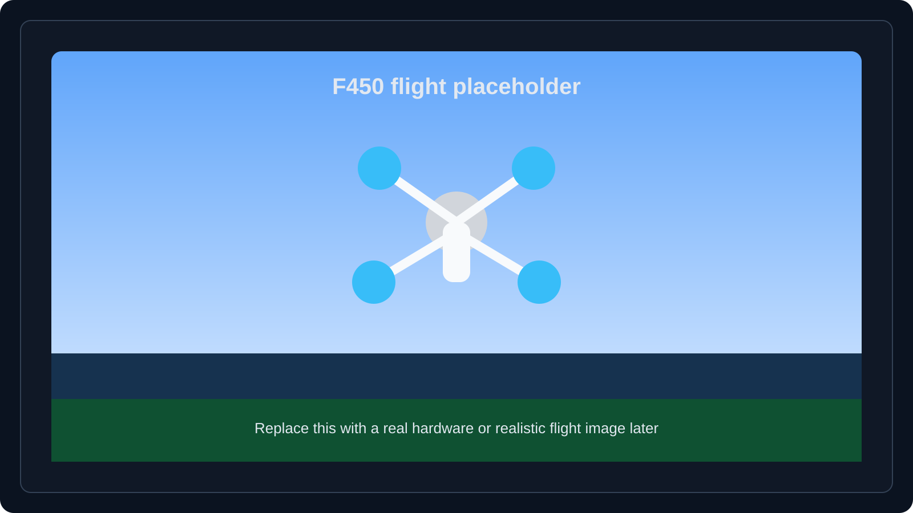
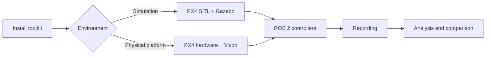

---
hide:
  - toc
---

  <h1>PX4 Development Toolkit</h1>
  
Reproducible PX4 and ROS 2 development from simulation to physical flight.

  

    Build, run, record, and analyze PX4 experiments using the same toolkit
    across Gazebo SITL and physical hardware.
  

  

    <a href="#choose-an-installation" class="md-button md-button--primary">Get started</a>
    <a href="#documentation" class="md-button">Documentation</a>
    <a href="https://github.com/ANCL/px4-dev-toolkit" class="md-button">View on GitHub</a>
  

  
  

  <a class="px4-card" href="#choose-an-installation">
    <h3>Installation</h3>
    
Start with the published Docker images or install the toolkit natively on Ubuntu 24.04.

    Choose an installation →
  </a>

  <a class="px4-card" href="environments/sitl/">
    <h3>Simulation</h3>
    
Run PX4 SITL with Gazebo, uXRCE-DDS, MAVProxy, and QGroundControl.

    Run SITL →
  </a>

  <a class="px4-card" href="environments/hardware/">
    <h3>Hardware</h3>
    
Run the same ROS 2 workflows with a physical PX4 vehicle, serial XRCE-DDS, and Vicon motion capture.

    Run on hardware →
  </a>

  <a class="px4-card" href="controllers/overview/">
    <h3>Control</h3>
    
Develop and evaluate Offboard controllers, geometric SE(3) control, and reusable trajectories.

    Explore controllers →
  </a>

  <a class="px4-card" href="analysis/analysis/">
    <h3>Analysis</h3>
    
Record repeatable experiments and analyze trajectories, controller behavior, and the PX4 control pipeline.

    Analyze results →
  </a>

## Choose an installation

Use either installation path depending on how you want to work.

**[Docker](installation/docker.md)** provides the lowest-setup path using the published SITL and hardware images.

**[Native](installation/native.md)** installs ROS 2, PX4 dependencies, pinned sources, and the toolkit workspace directly on Ubuntu 24.04.

Both provide the same toolkit workflows after installation.

## From simulation to hardware

The toolkit keeps the workflow consistent across the two runtime environments.

## Suggested first journey

For a new simulation user:

1. [Install with Docker](installation/docker.md) or [install natively](installation/native.md).
2. [Run the SITL environment](environments/sitl.md).
3. Review the [controller overview](controllers/overview.md).
4. [Run the SE(3) controller](controllers/se3.md).
5. [Record a run](workflows/recording.md) or [run a sequence](workflows/sequences.md).
6. [Analyze](analysis/analysis.md) and [compare](analysis/comparison.md) the results.

## Documentation

Browse all documentation using the sidebar, or jump directly to a topic:

- **Installation:** [Docker](installation/docker.md) · [Native](installation/native.md)
- **Environments:** [SITL](environments/sitl.md) · [Hardware](environments/hardware.md)
- **Controllers:** [Overview](controllers/overview.md) · [SE(3)](controllers/se3.md) · [Trajectories](controllers/trajectories.md)
- **Workflows:** [Recording](workflows/recording.md) · [Sequences](workflows/sequences.md)
- **Analysis:** [Single-run analysis](analysis/analysis.md) · [Comparison](analysis/comparison.md)
- **Reference:** [Architecture](reference/architecture.md) · [Configuration](reference/configuration.md) · [Extending](reference/extending.md) · [Troubleshooting](reference/troubleshooting.md)
