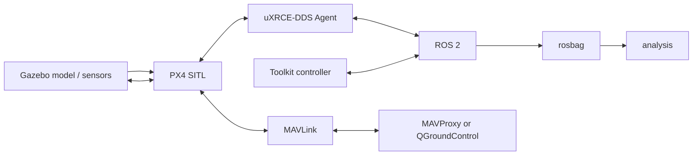
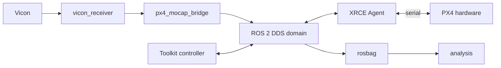

# Architecture

[Documentation](../index.md) / Reference / Architecture

This page describes the toolkit's ownership boundaries and data flow. Operational commands live in the installation/environment/controller/workflow pages.

## Repository architecture

```text
analysis/    pure Python bag analysis, profiles, plots, comparisons
config/      project-wide runtime/vehicle/topic/sequence/source/version config
docker/      multi-stage SITL and hardware images + Compose
px4/         PX4 build helper; fetched PX4 source lives below this directory
ros2/        ROS 2 workspace and maintained toolkit packages
setup/       native install and pinned-source reconstruction
tools/       user-facing runtime, study, and analysis entry points
```

Fetched third-party repositories are reconstructed under `px4/`, `ros2/src/`, and `tools/` from the pinned manifests in `config/sources/*.repos`. They are kept separate from toolkit-owned code.

## ROS 2 packages

### `px4_bringup`

Owns reusable process launchers for services such as the uXRCE-DDS Agent and QGroundControl.

### `px4_control_common`

Owns shared control-side utilities, including the client used to control the repository MAVProxy virtual joystick.

### `px4_position_takeoff_hover`

Owns the native PX4 Position-mode reference flight experiment and its recording launch.

### `offboard_controllers`

Owns the Offboard staging helper, independent position controller, SE(3) controller, trajectory library, reproduced PX4 rate-control logic, physical-wrench adaptation, vehicle-config loading, launch files, and controller recording configuration.

### `px4_mocap_bridge`

Owns conversion from the selected Vicon `PoseStamped` stream to PX4 external-vision `VehicleOdometry`, plus the combined Vicon/bridge launch file.

## SITL data flow



The current SITL estimator configuration uses Gazebo odometry/external-vision aiding plus IMU according to `config/runtime/sitl.env`.

## Hardware data flow



The hardware runtime wrapper (`tools/experiment`) owns Vicon reception/bridge and XRCE agent process lifecycle; physical PX4 firmware runs on the flight controller.

## Controller pipeline ownership

The toolkit is designed to move the external-control boundary without changing the surrounding environment:

```text
trajectory reference
→ translational command
→ attitude reference
→ body-rate reference
→ thrust/torque
→ PX4 control allocation
→ actuators
```

`offboard_position` hands off at position/trajectory reference. SE(3) can hand off at acceleration, attitude, rate, or normalized thrust/torque.

## Topic catalog

PX4 ROS topic names are centralized in:

```text
config/px4_topics.def
```

C++ controller code, recording configuration, and Python analysis resolve the same catalog instead of maintaining independent literal topic-name copies.

## Source/runtime/data separation

- **source/configuration** describes what should run,
- **runtime wrappers** own process trees and lifecycle,
- **launch files/controllers** own experiment execution,
- **rosbag** captures immutable run data,
- **experiment metadata/manifests** preserve run context,
- **analysis** consumes the recorded data without changing the experiment.

## Next

- [Configuration ownership](configuration.md)
- [Extending the toolkit](extending.md)
- [Controller overview](../controllers/overview.md)
